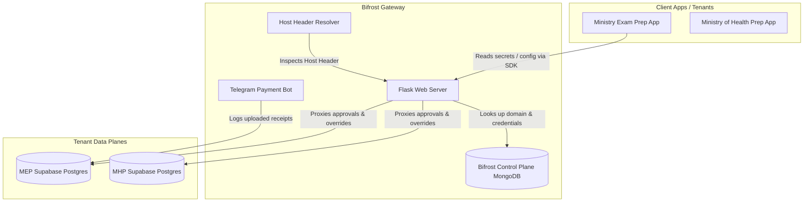

# Bifrost: Unified Multi-Tenant Identity, Vault & Entitlement Gateway
## Technical Architecture White Paper

---

## 1. Executive Summary & System Goals

Bifrost is a unified Identity Provider (IdP), Configuration Server, and Secrets Vault designed to manage configuration metadata, API keys, global user roles, and webhook definitions centrally. 

### Key Technical Objectives
1. **Control Plane Isolation**: Store encrypted client configurations, subscription plans, and API secrets in a centralized NoSQL database (MongoDB).
2. **Decentralized Data Plane (Tenant Database Proxying)**: Keep user data and tenant-specific records (e.g. transactions, course access, platform roles) strictly inside independent PostgreSQL/Supabase databases. Avoid caching tenant data inside Bifrost.
3. **Automated Client Secrets Bootstrapping**: Allow client applications to download and decrypt secrets dynamically at start time using a lightweight client SDK.
4. **Dynamic Domain Routing**: Support custom CNAME subdomains (e.g. `backoffice.tenant.kh`) terminated at the proxy layer, routing requests dynamically to target tenant dashboards by inspecting the HTTP `Host` header.
5. **Human-in-the-Loop Entitlement Queue**: Facilitate manual validation of bank receipts (such as KHQR transactions) using a real-time web console and Telegram bot handlers.

---

## 2. System Topology & Architecture

Bifrost employs a split-plane design to decouple configuration management from operational databases:

### 2.1 The Control Plane (MongoDB)
The central MongoDB instance stores:
* **Applications Schema**: Configurations, `client_id`, `webhook_secret`, `db_connection` strings, and encrypted `api_keys`.
* **Accounts Schema**: Global user identities, linked accounts (Telegram, OAuth2, etc.), and central RBAC mappings.
* **Transactions Cache**: Ephemeral payment records for MongoDB-backed tenant apps.

### 2.2 The Tenant Data Plane (PostgreSQL)
For SQL-backed applications (like Ministry Exam Prep), Bifrost connects to the tenant's PostgreSQL database on demand using connection strings stored securely in the app document. Writes are made directly to the tenant's tables:
* `users`
* `payments`
* `entitlements`

---

## 3. Security Model & Data Integrity

### 3.1 Cryptographic Key Vault (Envelope Encryption)
API keys and secrets uploaded to Bifrost are encrypted server-side using the AES-256-CBC algorithm. The encryption/decryption key is derived from the application's unique `webhook_secret` (stored in Bifrost) acting as the master key.
* Only the client application that holds the `webhook_secret` is authorized to download and decrypt its configurations.
* Bifrost admins cannot view secrets in plaintext from direct database lookups.

### 3.2 Database Access and Role Restrictions
To enforce tenant database security, connection strings stored in Bifrost must never use the PostgreSQL master admin (`service_role` or `postgres`) user. 
Instead, developers must configure a scoped database role (e.g., `bifrost_cms_agent`) with restricted privileges:
* `SELECT`, `INSERT`, `UPDATE` on `payments` and `entitlements`.
* `SELECT` on `users`.
* No DDL privileges (`DROP`, `ALTER`, `CREATE` tables).

---

## 4. Multi-Tenant Domain Routing

Custom subdomain routing utilizes a standard `CNAME` setup. The client points `backoffice.tenant.kh` to the Bifrost server domain (`cname.bifrost.io`). 

### Resolution Flow (before_request Hook)
1. The client browser visits `backoffice.tenant.kh`.
2. The request reaches the Flask application.
3. The custom middleware hook parses the HTTP `Host` header, cleaning any local ports.
4. Bifrost queries the MongoDB `applications` collection for a matching `custom_domain`.
5. If found:
   * The app configuration and ID are loaded into the Flask thread-local context `g.tenant_app` and `g.tenant_app_id`.
   * Requests hitting `/` are automatically redirected to `/backoffice/app/<app_id>` to lock the user's viewport to their specific backoffice panel.

---

## 5. Manual Payments & Integration Protocols

### 5.1 Webhook Entitlement Synchronization
When subscription overrides occur (via the CMS Console or the Telegram Bot), Bifrost issues an event-driven POST request to the client app's `webhook_url`:
* **Signature Header**: `X-Bifrost-Signature` is computed as:
  $$\text{HMAC-SHA256}(\text{Payload}, \text{webhook\_secret})$$
* **Verification**: The client application computes the same hash and validates the signatures to authenticate the payload.

### 5.2 Bot-to-PostgreSQL Pipeline
When a user uploads a receipt image to the Telegram payment bot:
1. The bot retrieves the user's email by mapping their Telegram ID in MongoDB.
2. The bot establishes a temporary connection to the tenant's PostgreSQL database and queries the `users` table for the matching email.
3. If found, a new transaction record is inserted into the tenant's `payments` table with status `pending`, along with the Telegram image URL.
4. An inline message is pushed to the admin group with buttons mapped to the Postgres payment ID.
5. Action callbacks (Approve/Reject) update the SQL database status and toggle entitlements in real-time.

---

## 6. Service Segmentation & Custom Feature Toggles

To support a custom mix of functionalities for different tenant client applications, Bifrost implements a granular service segmentation layer (`enabled_services`). 

Adopting client applications can toggle individual features on or off in their central registry profiles:
* **Secrets Vault (`secrets_vault`)**: Serves environment configurations and decodes vault API payloads.
* **Payment Bot (`payment_bot`)**: Processes bank receipt uploads and executes inline keyboard callback approvals.
* **SSO Identity Provider (`oauth_sso`)**: Handles third-party OAuth2/OIDC login redirections.
* **SMS Gateway (`sms_otp`)**: Manages one-time passwords via Twilio.
* **Email Gateway (`email_otp`)**: Handles transactional code authorizations.
* **Heimdall Monitor (`heimdall_monitor`)**: Collects AI usage statistics and cost breakdowns.

When a client application makes an API request or trigger event, the Bifrost middleware checks the `enabled_services` status before processing, enforcing service-level permission constraints at the gateway layer.

---

## 7. Onboarding & Continuous Verification

To ensure that the platform remains stable as updates are introduced, a verification pipeline is enforced:
1. **Dependency check**: All package installations use the `uv` tool to manage and cache Python modules.
2. **Setup Automation**: The setup script `scripts/init_dev.sh` automatically compiles source files, retrieves environment variables, and executes unit tests.
3. **Continuous Testing**: All database proxies and Telegram handler states are verified using mock-driven unit testing (`test_tenant_db.py` and `test_bot_integration.py`).
