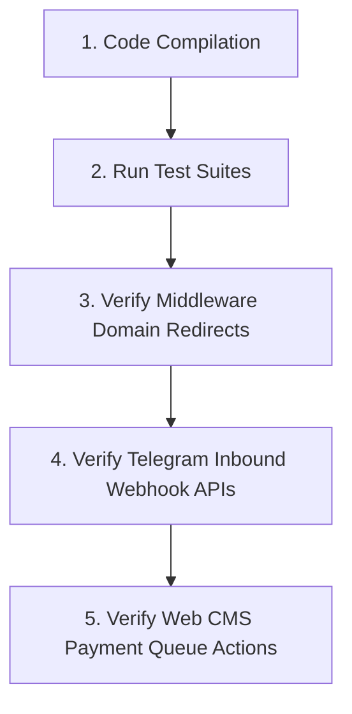

# Bifrost Verification & Testing Pipeline

This guide outlines the testing suite and release verification pipelines required before merging or deploying updates.

---

## 1. Automated Integration Test Pipeline

The codebase includes two core mock-based test suites validating database operations and Telegram bot logic without requiring live PostgreSQL or Telegram Server instances.

### 1.1 Database Mock Suite
* **File**: `scratch/test_tenant_db.py`
* **Coverage**: Verifies `psycopg2` SQL queries, columns verification logic (`information_schema.columns`), user overrides, and atomic entitlement modifications.
* **Execution**:
  ```bash
  .venv/bin/python3 "/Users/nicksng/.gemini/antigravity-ide/brain/6237d06b-53b6-453a-b0ec-837e1c74c3b1/scratch/test_tenant_db.py"
  ```

### 1.2 Bot Integration Mock Suite
* **File**: `scratch/test_bot_integration.py`
* **Coverage**: Verifies user receipt uploads, MongoDB user email lookups, PostgreSQL payment row insertions, and inline button callback payloads.
* **Execution**:
  ```bash
  .venv/bin/python3 "/Users/nicksng/.gemini/antigravity-ide/brain/6237d06b-53b6-453a-b0ec-837e1c74c3b1/scratch/test_bot_integration.py"
  ```

---

## 2. Manual Pre-Release Checklist

Perform these checks sequentially before promoting code to production:



### Phase 1: Compile Check
Run syntax compilation on all core files:
```bash
python3 -m py_compile run.py config.py bifrost/__init__.py bot/main.py bot/services.py
```
Ensure no syntax or missing import statements crash the boot sequence.

### Phase 2: Host Header Redirection Checks
Validate that the Flask subdomain routing works dynamically:
1. Start the Flask server:
   ```bash
   .venv/bin/python3 run.py
   ```
2. Run a `curl` header injection request matching a registered custom domain:
   ```bash
   curl -I -H "Host: backoffice.wkc.kh" http://localhost:5000/
   ```
3. **Expected Result**: HTTP `302 Found` with redirection pointing to `/backoffice/app/<app_id>`.

### Phase 3: SLA Alert & Webhook Ingestion Checks
Verify that the inbound webhook alert API accepts payments and triggers notification dispatch:
1. Send a mock POST payload representing a user uploading a receipt:
   ```bash
   curl -X POST -H "Content-Type: application/json" \
     -d '{"txn_ref": "tx-9999", "email": "tester@wkc.kh", "amount": "15.00", "receipt_url": "https://telegram.org/photo.png"}' \
     http://localhost:5000/api/tenant/<app_id>/payments/notify-new
   ```
2. **Expected Result**: HTTP `200 OK` with JSON response: `{"status": "success", "alert_sent": true/false}`. 
3. Verify that the configured Telegram channel receives the formatted alert.

### Phase 4: Bot Photo Ingestion Validation
Verify that user photo uploads in the Telegram payment bot insert records into the tenant's Postgres database:
1. Send a payment receipt photo to the bot.
2. Query the PostgreSQL table:
   ```sql
   SELECT * FROM payments WHERE status = 'pending' ORDER BY id DESC LIMIT 1;
   ```
3. Verify that `receipt_url` contains the downloadable Telegram direct file URL and `status` is `pending`.
